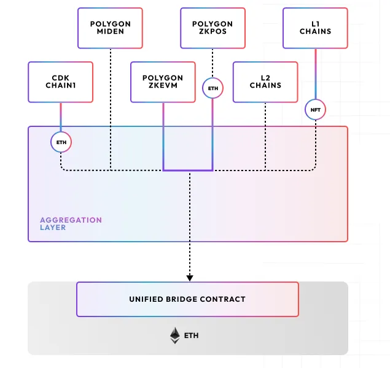

<!-- PROJECT LOGO -->
 

  
  

 

<h1>Agglayer</h1>

The <b>Agglayer</b> (<i>Aggregation layer</i>) provides a common language for secure, atomic, interoperability among heterogeneous chains. (WIP)

 

## Getting Started

Rust implementation of the Agglayer.

Agglayer is a web service that receives ZKPs from different CDK chains and checks the soundness of them before sending the ZKP to L1 for verification.

To find out more about Polygon, visit the [official website](https://docs.polygon.technology/cdk/).

WARNING: This is a work in progress, and as such, all APIs and configuration are subject to change. The code is still being audited, so please contact the Polygon team if you would like to use it in production.

### Prerequisites

* For each CDK chain it's necessary to configure its corresponding RPC node, synced with the target CDK. This node will be used for checking the state root after executions of L2 batches.

## Development

Contributions are very welcomed, the guidelines are currently not available (WIP)

## Support

Feel free to [open an issue](https://github.com/agglayer/agglayer/issues/new) if you have any feature request or bug report. 

## Resources
  
## License
Copyright (c) 2024 PT Services DMCC

Licensed under either of

* Apache License, Version 2.0, ([LICENSE-APACHE](LICENSE-APACHE) or http://www.apache.org/licenses/LICENSE-2.0)
* MIT license ([LICENSE-MIT](LICENSE-MIT) or http://opensource.org/licenses/MIT)

at your option. 

The SPDX license identifier for this project is `MIT OR Apache-2.0`.
