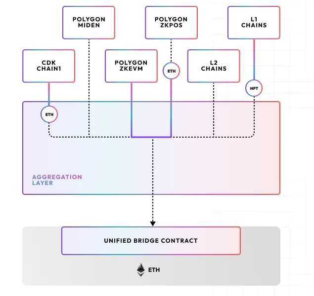

<div id="top"></div>
<!-- PROJECT LOGO -->
<br />
<div align="center">

  
  

<br />

<h1>Agglayer</h1>

<p align="center">
The <b>Agglayer</b> (<i>Aggregation layer</i>) provides a common language for secure, atomic, interoperability among heterogeneous chains. (WIP)
</p>
</div>

<br />

<div align="center">

[](https://github.com/agglayer/agglayer/actions/workflows/test.yml)
[](https://github.com/agglayer/agglayer/actions/workflows/quality.yml)
[](https://codecov.io/gh/agglayer/agglayer)

<hr />



</div>

## Table of Contents

- [Overview](#overview)
- [Documentation Entry Points](#documentation-entry-points)
- [Repository Structure](#repository-structure)
- [Prerequisites](#prerequisites)
  - [Succinct Prover Network](#succinct-prover-network)
  - [Software Requirements](#software-requirements)
  - [Hardware Requirements](#hardware-recommendations)
- [Installation](#installation)
- [Running the Pessimistic Proof Test Suite](#running-the-pessimistic-proof-test-suite)
- [Development](#development)
- [Support](#support)
- [Resources](#resources)
- [License](#license)

## Overview

Agglayer is the Rust-based service designed to: 
1. Receive updates from Agglayer-connected chains 
2. Verify their validity 
3. Send them to the L1 for final settlement. 

To find out more about Agglayer, please visit [the more detailed documentation.](https://docs.agglayer.dev/)

> [!WARNING]
>    - Some of the content in this section discusses technology in development and not ready for release. As such, all APIs and configuration are subject to change. The code is still being audited, so please contact the Polygon team if you would like to use it in production.

## Documentation Entry Points

- **Knowledge base (human-first):** `docs/knowledge-base/src/`.
  Published at `https://agglayer.github.io/agglayer/`.
- **Rust API docs:** generated with `cargo doc`.
  Published at `https://agglayer.github.io/agglayer/rustdoc/agglayer/`.
- **Local knowledge-base build:**

  ```bash
  mdbook build docs/knowledge-base/
  ```

See `docs/knowledge-base/src/docs-publishing.md`
for CI and deployment details.

## Repository Structure

The canonical crate/domain ownership map is maintained in
`docs/knowledge-base/src/architecture.md`.
Use that chapter as the single source of truth when crate responsibilities change.

Top-level layout:

- `crates/`: workspace crates and runtime components.
- `proto/`: protobuf schemas and generation config.
- `docs/`: contributor docs,
  audits,
  and the knowledge base.
- `tests/`: integration and system-level test suites.

## Prerequisites

Before working with the repository, you’ll need the following:

### Succinct Prover Network

You’ll need to submit a unique Ethereum address to Succinct for access to their proving network. To get access:

1. Follow the instructions [here](https://docs.succinct.xyz/docs/sp1/prover-network/quickstart) to use Foundry to generate a new private key or retrieve an existing one.
2. Apply for access for the public address associated with your private key to Succinct Network [here](https://docs.google.com/forms/d/e/1FAIpQLSd-X9uH7G0bvXH_kjptnQtNil8L4dumrVPpFE4t8Ci1XT1GaQ/viewform).

### Software Requirements
* [Rustup](https://www.rust-lang.org/tools/install) (stable)
* [protoc](https://grpc.io/docs/protoc-installation/)
* [nextest](https://nexte.st/docs/installation/pre-built-binaries/#with-cargo-binstall)
* [cargo-make](https://github.com/sagiegurari/cargo-make#installation)
* [cargo-insta](https://insta.rs/docs/quickstart/)
* [Go](https://go.dev/doc/install)

### Hardware Recommendations
With SP1, you do not need to generate proofs locally on your machine.

However, if you’d like to run a prover locally (not recommended), you’ll need roughly 40-50GB of available RAM.

## Installation

To install the Agglayer repository, please run the following:

```bash
git clone https://github.com/agglayer/agglayer
cd agglayer
```

To build Agglayer locally, please run:
```bash
cargo build
```

## Running the Pessimistic Proof Test Suite
To run the Pessimistic Proof Test Suite with test inputs in Native Rust Execution, please run the following:

```bash
cargo test --package pessimistic-proof-test-suite
```

You can find the test inputs here: [`./agglayer/crates/pessimistic-proof-test-suite`](./crates/pessimistic-proof-test-suite/data/)

## Modifying and building the Pessimistic Proof

By default, the committed pre-compiled ELF binary is used.
Modifications in PP code will not be automatically reflected in the binary.
We use docker-based deterministic build to compile the proof.
Therefore, `docker` has to be present on the system for the build to work if PP rebuild is enabled.

### Building PP one-off

The following command rebuilds the PP and updates some snapshot tests that depend on it.
It requires `cargo-make` to be installed:

```sh
cargo make pp-elf
```

### Turning on automatic PP rebuild

This option makes the standard commands like `cargo build`, `cargo run` etc. rebuild the PP automatically any time it changes as if it were a normal part of the build.
It is enabled by setting the `AGGLAYER_ELF_BUILD` environment variable to `update`.

```sh
export AGGLAYER_ELF_BUILD=update
```

Note: Rust suppresses the output of build scripts by default.
As a result, the build may appear stuck on the `pessimistic-proof` crate while the PP is being rebuilt.

In the `update` mode, the proof will be rebuilt and the cached ELF will be updated.
There is also the `build` mode which leaves the cached ELF intact.
It is mostly useful for debugging, the `update` is more suitable for regular development.

To get automatic rebuilds by default, set the variable in the shell init script.

### Proof versioning policy

The proof binary to use is uniquely identified by a vkey selector on the L1.
The selector is derived from the major version of the `pessimistic-proof-program` package.
This version must be bumped between releases / deployments.

There is a snapshot test that will fail once the proof vkey changes to prompt the developers to consider whether a version bump is needed.
Once that is determined and the package version is updated (or not updated, as appropriate), the new vkey is accepted by running:

```sh
cargo make pp-accept-vkey-change
```

## Running SP1 Proof Generation Locally (Not Recommended)

The [Succinct Prover Network](#succinct-prover-network) is the best way to generate Pessimistic Proofs for Agglayer. 

For those with the hardware and know-how, however, you can run the Pessimistic Proof program in a local SP1 Prover with the following commands:

```bash
cargo run --package pessimistic-proof-test-suite --bin ppgen
```


## Running Integration Tests

### Prerequisites

The integration tests now use a checked-in Anvil fixture by default.
You only need Foundry's `anvil` binary installed locally.

### Running the tests

Once the prerequisites are ready, you can now return to the main agglayer directory and run the integration tests:
```bash
cargo nextest run --workspace -P integrations --no-fail-fast --retries 2
```

If you need to regenerate the fixture after the contracts image changes, run:

```bash
tests/integrations/scripts/generate_anvil_l1_fixture.sh
```

This rebuilds `tests/integrations/fixtures/anvil-l1/state.json`
from `hermeznetwork/geth-zkevm-contracts`.

If you need to compare behavior against the legacy backend,
set `AGGLAYER_INTEGRATION_L1_BACKEND=docker` before running the tests.

### Potential issues

If the fixture needs to be refreshed,
re-run `tests/integrations/scripts/generate_anvil_l1_fixture.sh`
and commit both the updated `state.json` and `metadata.json` files.

Also, there are quite a few intermittent failures in the tests, that can be helped thanks to the suggested `--retries 2`.

Finally, `--no-fail-fast` is useful to start the integration tests and then come back after a coffee to see all the failing tests: a full run of integration test takes around ten minutes on a Macbook M4 Pro.

## Development

Contributions are very welcome, the guidelines are currently not available (WIP)

## Support

Feel free to [open an issue](https://github.com/agglayer/agglayer/issues/new) if you have any feature request or bug report.<br />

## Resources
  
## License
Copyright (c) 2024 PT Services DMCC

Licensed under either of

* Apache License, Version 2.0, ([LICENSE-APACHE](LICENSE-APACHE) or http://www.apache.org/licenses/LICENSE-2.0)
* MIT license ([LICENSE-MIT](LICENSE-MIT) or http://opensource.org/licenses/MIT)

at your option. 

The SPDX license identifier for this project is `MIT OR Apache-2.0`.
