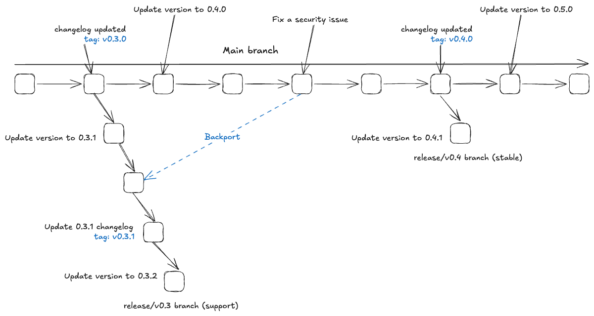

# Release Strategy

## Overview

This document provides a comprehensive guide to our release management process, defining how we coordinate, version, and deploy our Docker-based application. It establishes clear procedures for creating consistent releases while maintaining quality and minimizing coordination overhead.

The strategy covers automated workflows for minor releases (new features) and patch releases (bug fixes and security updates). This document focuses specifically on minor and patch version management and does not address major version updates, which require separate planning and coordination due to their breaking change implications.

## Release Types

Our release strategy supports two distinct types of releases, each serving different purposes and following specific workflows.

### Minor Releases
Minor releases represent our primary feature delivery mechanism, originating from the `main` branch and following the version format `vX.Y.0` (such as `v1.2.0`). These releases incorporate new features, enhancements, and non-breaking changes that have been developed and tested on the main development branch. We create minor releases manually based on feature readiness and business needs, typically averaging every 12 to 13 weeks, allowing for thorough feature development and quality assurance.

### Patch Releases
Patch releases address critical bug fixes, security vulnerabilities, and other urgent issues that need to be deployed without waiting for the next minor release cycle. These releases use the version format `vX.Y.Z` (such as `v1.2.1`) and are created from existing release branches (`release/vX.Y`). Patch releases are created on-demand as issues arise, ensuring we can respond quickly to production problems while maintaining stability.

## Release Process

The following diagram illustrates our branch strategy and release flow:

<picture>
  <source media="(prefers-color-scheme: dark)" srcset=".github/assets/release_flow_x1_dark.png">
  <source media="(prefers-color-scheme: light)" srcset=".github/assets/release_flow_x1_light.png">
  
</picture>

This diagram illustrates our complete release workflow: minor releases branch from main development, release branches are maintained for patches, and critical fixes can be backported from main to older versions when needed.

### Step 1: Release Initiation

The release process begins when a codeowner determines that the codebase is ready for a new release. This decision is typically made after evaluating completed features, bug fixes, and overall code stability. Codeowners initiate the release through GitHub's manual workflow dispatch interface, selecting only the target branch (`main` for minor releases or `release/vX.Y` for patch releases). 

The system automatically determines the appropriate version number by reading the current version from `Cargo.toml` and applying our semantic versioning rules. This eliminates manual version input errors and ensures consistency with our established versioning strategy.

### Step 2: Automated Release Preparation

Once triggered, our automated system creates a dedicated release branch following our naming convention (`release/vX.Y` for minor releases or `release/vX.Y.Z` for patches). The system then performs several critical tasks: it reads the current version from `Cargo.toml` to determine the release version, generates a comprehensive changelog using `git-cliff` based on our conventional commit history, and creates a pull request tagged with the `release` label.

This automation ensures that all release preparations follow identical procedures, reducing human error and maintaining consistency across all releases. The generated changelog provides a clear overview of what changes will be included in the release, enabling informed review decisions.

### Step 3: Review and Quality Gate

The release PR enters a critical review phase where codeowners examine the generated changelog, verify the version bump logic, and ensure all intended changes are properly captured. During this review period, our automated systems prevent any other pull requests from merging to the target branch, creating a controlled environment that eliminates race conditions and ensures the release content matches the reviewed changelog.

If the base branch receives updates during the review process, our automation automatically updates the release PR by rebasing or merging the changes and regenerating the changelog. This keeps the release current while maintaining the integrity of the review process. The PR can only be merged after receiving explicit codeowner approval.

### Step 4: Automated Testing and Validation

Upon successful merge of the release PR, the system immediately creates a draft GitHub release and initiates comprehensive validation testing. This testing phase includes Docker image building, smoke tests to verify basic functionality, and any additional validation tests specific to our application requirements. The draft status ensures that the release remains unpublished while validation is in progress.

Simultaneously, a GitHub discussion is automatically created with detailed release information, providing a centralized location for team communication about the release. This discussion includes links to the release, relevant documentation, and serves as a platform for addressing any questions or concerns about the release content.

### Step 5: Release Publication and Iteration Preparation

Once all validation tests pass successfully, the system proceeds with the final release steps. Docker images are built and pushed to our container registry with appropriate version tags, making them available for deployment. The GitHub release is then promoted from draft to published status, officially making the release available to users and triggering any downstream deployment processes.

To prepare for future development, the system automatically creates a follow-up pull request that bumps the version number in the source branch to the next development version. This ensures that subsequent commits will be properly versioned and the repository remains ready for the next development cycle without manual intervention.

## Branch Strategy

Our branching strategy is designed to support parallel development and maintenance workflows while maintaining clear separation between ongoing feature development and stable release maintenance. This approach enables us to deliver new features on the main branch while simultaneously providing critical fixes for previously released versions.

### Main Branch Philosophy

The main branch serves as our primary development artery, representing the latest state of our codebase and the foundation for all future releases. This branch maintains a continuous flow of new features, improvements, and non-breaking changes that have passed through our merge group validation process. 

The main branch follows a strict versioning discipline where the version number in `Cargo.toml` always reflects the next intended minor release in the format `vX.Y.0`. This convention ensures that every commit on main is clearly associated with an upcoming feature release, eliminating ambiguity about which version will contain specific changes.

Following each minor release from main, our automation immediately increments the version to the next minor version (e.g., from `v1.2.0` to `v1.3.0`), ensuring that subsequent development work is properly versioned and the branch remains ready for the next development cycle. This automatic versioning prevents version conflicts and maintains a clear progression of development milestones.

### Release Branch Strategy

Release branches represent long-lived maintenance streams that support our commitment to providing ongoing support for published versions. Each minor release from main automatically creates a corresponding release branch following the naming convention `release/vX.Y`, where the branch name directly corresponds to the minor version line it supports.

These branches serve multiple critical functions: they provide a stable foundation for patch releases, enable selective backporting of critical fixes, and allow for maintenance work that doesn't interfere with ongoing main branch development. The isolation provided by release branches ensures that patch development can proceed independently of new feature work, reducing complexity and risk.

Release branches maintain their own version progression for patch releases, with `Cargo.toml` reflecting the current patch level within that release line. After each patch release, the branch version automatically increments to the next patch number (e.g., from `v1.2.1` to `v1.2.2`), maintaining the same disciplined versioning approach as the main branch but within the patch version space.

### Branch Preservation Policy

Release branches are preserved to support ongoing maintenance of active release lines. We maintain release branches for currently supported versions, enabling patch releases and critical security updates while providing clear audit trails for compliance and debugging purposes. However, we do not provide indefinite support for all historical releases - only the release lines that remain actively supported receive maintenance updates.

## Version Bumping Rules

| Release From | Current Version | Next Dev Version |
|--------------|----------------|------------------|
| `main` | `v1.2.0` | `v1.3.0` |
| `release/v1.2` | `v1.2.3` | `v1.2.4` |

## Release Candidates

Our release process supports an optional Release Candidate phase that allows for additional validation and stakeholder testing before final publication. Release Candidates use the same automated workflow and validation processes as regular releases, but with extended testing opportunities.

### When to Use Release Candidates

Release Candidates are particularly valuable for releases that include:
- Significant new features or architectural changes
- Updates that affect critical system components
- Releases following extended development periods
- Changes that require stakeholder or user validation before general availability

### Release Candidate Workflow

Release Candidates are created using the same workflow dispatch process as regular releases, with an additional parameter to designate the release as a candidate. When the "Release Candidate" option is selected, the system bypasses the standard PR creation and review process, instead creating a direct git tag with the appropriate RC suffix (e.g., `v1.2.0-rc.1`) and immediately publishing it as a pre-release on GitHub.

The RC follows the same automated validation and testing steps as a final release, ensuring that the candidate receives the same rigorous quality gates, but skips the codeowner review process since RCs are intended for testing rather than formal approval. Release Candidates do not trigger the automatic version bumping for the next development iteration, as the version remains unchanged until the final release is published from the same commit. This streamlined approach enables rapid iteration on release candidates while maintaining comprehensive technical validation.

### Creating Final Release from Release Candidate

Once stakeholder testing and validation are complete, the Release Candidate can be converted to a final release by running the workflow again targeting the exact same commit that was used for the RC, but without the Release Candidate flag. This ensures that the final release is built from the identical codebase that was tested during the RC phase, eliminating any risk of untested changes being introduced.

The workflow follows the complete process including PR creation, codeowner review, and formal approval before creating the final version (e.g., `v1.2.0`), ensuring that the final release receives proper governance while building from the exact same tested commit. This approach generates new Docker images with final version tags while preserving the RC artifacts for audit and rollback purposes, maintaining full traceability and providing confidence that the published version matches exactly what was validated during the RC phase.
