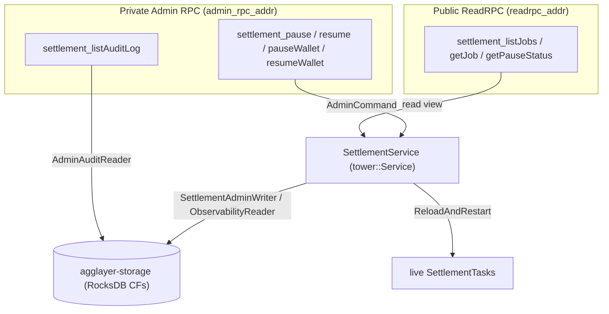
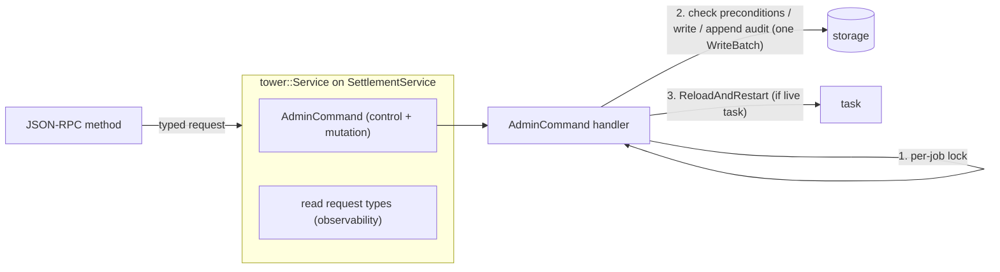
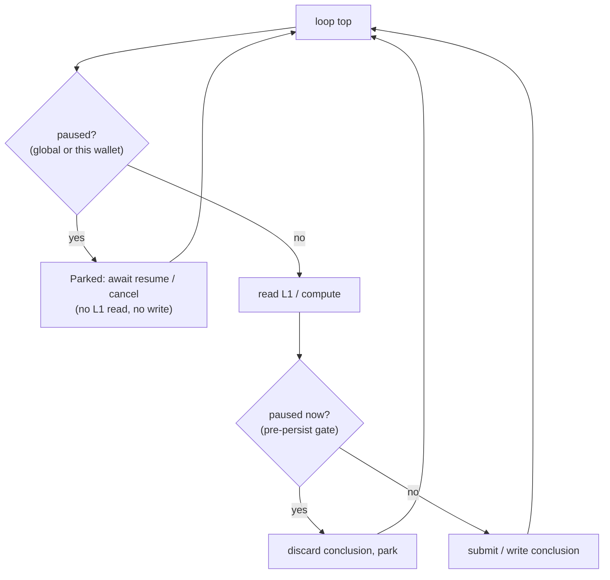

# Settlement service pause, observability, and audit — design

| | |
|---|---|
| **Status** | Draft for review |
| **Date** | 2026-06-08 (trimmed to the remaining surface 2026-07-07) |
| **Ticket** | [agglayer/agglayer#1254](https://github.com/agglayer/agglayer/issues/1254) |
| **Target** | The `agglayer-settlement-service` crate |
| **Decision owners** | @Ekleog-Polygon (settlement design intent), @Freyskeyd (assignee) |

> **Scope note (2026-07-07).**
> The original #1254 admin API design was split in two.
> The mutation surface — registering and correcting attempts and job results,
> plus the JSON-RPC exposure of the abort/reload task controls —
> is implemented and recorded in
> [Settlement admin mutations](2026-07-07-settlement-admin-mutations-design.md),
> together with its deliberate deviations from the original draft.
> This document covers only the remaining, not-yet-implemented surface:
> pause/resume with full quiesce and drain reporting,
> the observability read surface, and the durable admin audit log.

## Summary

This document designs the pause, observability, and audit surface
of the settlement service admin API
(`crates/agglayer-settlement-service`).

The settlement service drives one L1 contract call per `SettlementJob`
until it lands, retrying across nonces and wallets.
It is intentionally **infallible**:
a job has no terminal-failure state,
so the orchestrator can safely iterate on subsequent certificates.

Three capability groups remain to build:

- **Observability** — list and inspect jobs, attempts, results,
  derived status, and pause/drain status.
- **Control** — globally or per-wallet pause/resume settlement,
  with a trustworthy "everything has stopped" signal.
- **Audit** — a durable, reusable log of every state-changing admin action,
  covering this surface and the implemented mutation surface.

The anchor scenario is an **emergency pause during an L1 incident**:
a full quiesce in which tasks stop both submitting transactions
and writing on-chain-derived conclusions until an operator resumes.

## Goals

- Make pause safe to operate in production.
- Provide the minimum observability required to operate the admin surface
  without flying blind (there is no "list jobs" or status view today).
- Preserve the infallible-`SettlementJob` invariant.
- Inherit the "do no harm" properties of the existing admin surface
  (atomic, preconditioned edits; storage as single source of truth).
- Leave a durable forensic audit trail of every state-changing admin action.

## Non-goals

- The attempt/job mutation surface and the task abort/reload controls:
  implemented, and covered by the
  [mutations document](2026-07-07-settlement-admin-mutations-design.md).
- A job-level terminal-failure state.
  This contradicts the infallible-job invariant
  and is deferred to an explicit maintainer decision (see Open Questions).
- Authentication/authorization beyond the existing network-boundary trust model.
- Retrofitting the existing certificate/network admin paths onto the new
  audit log (the audit envelope is designed to be reusable, but only
  settlement is wired up here).

## Locked decisions

| # | Decision | Choice |
|---|---|---|
| D1 | Scope | Control **and** observability plane |
| D2 | Primary scenario | Emergency pause during an L1 incident |
| D3 | What pause freezes | Submissions **and** conclusions (full quiesce) |
| D4 | Pause granularity | Global **and** per-wallet, persisted across restart |
| D7 | Trust + audit | Network-boundary trust + durable, reusable audit log; tower `Layer` for tracing/metrics |
| D8 | Transport | Public reads on ReadRPC; mutations + audit read on the private Admin RPC; internal surface is the tower `AdminCommand` service |

D5 (mutation model) and D6 (double-settle posture) from the original design
are implemented; the mutations document records them,
including where the implementation deviates from the draft
(per-operation preconditions instead of literal `from=`/`to=` snapshots,
append-only insert instead of upsert).

## Background: the settlement service

### Data model

Defined in `crates/agglayer-types/src/settlement.rs`.

- **`SettlementJob`** — one L1 contract call to land:
  `contract_address`, `calldata`, `eth_value`, `gas_limit`.
  Identified by a **`SettlementJobId`** (a `ulid::Ulid`, time-sortable).
- **`SettlementAttempt`** — one submitted L1 transaction for a job,
  keyed by `(sender_wallet, nonce)` then `attempt_number`:
  `sender_wallet`, `nonce`, `hash`, `submission_time`.
- **`SettlementAttemptResult`** — per-attempt outcome:
  `ClientError` (never reached a definitive on-chain state)
  or `ContractCall` (landed, `Success` or `Revert`).
- **`SettlementJobResult`** — the single terminal result of a job.
  It **requires** a `ContractCallResult`:
  a terminal outcome must have landed on-chain.

### Lifecycle

There is no explicit status enum.
Job state is *derived*: a job is pending while a `SettlementJob` row exists
with no `SettlementJobResult`, and completed once the result row is written.
The state machine lives entirely in `SettlementTask::run()`,
a single loop that polls control actions, queries L1 for each known nonce,
and writes a terminal result when an attempt settles.

### Current state (2026-07-07)

- The service is wired into the node (#1393),
  and the execution primitives that were stubs in the original draft
  have landed: startup recovery (#1230),
  nonce assignment and fee bumping (#1318/#1319),
  and submit-to-L1 (#1321).
- The mutation surface and the abort/reload task controls are implemented
  on the private admin listener,
  and live tasks apply stored edits by reloading from storage
  (mutations document).
- What does not exist yet is exactly this document's surface:
  no pause mechanism, no list/status observability,
  and no durable audit of admin actions.
- The closest existing admin template is the JSON-RPC `admin` namespace
  (`crates/agglayer-jsonrpc-api/src/admin.rs`),
  especially `forceEditCertificate`:
  atomic precondition edits with optional reprocessing.

## Architecture overview

### Two surfaces, two trust tiers



- **Public ReadRPC** carries only chain-mirroring observability,
  which is public-equivalent because settlement transactions are on public L1.
- **Private Admin RPC** carries every state-changing operation
  plus the audit-log read
  (the only place `actor`/`reason` operator metadata is exposed).
- No new listener is introduced;
  both surfaces reuse the transports the node already binds.

Most public reads are store-backed,
but `getPauseStatus` and the `live_phase` field of `getJob`
need the in-memory task registry,
so the public router receives a **read-only view of `SettlementService`**
(its observability methods), not just the store.

### Internal surface: the tower `AdminCommand` service

The JSON-RPC methods are **thin adapters**.
They deserialize a request, build a typed tower request, call the service,
and serialize the response.
They never touch storage directly.



The `AdminCommand` handler is the single choke point
where audit-row writes and the admin mutation transaction live.
This extends the existing `AdminCommand` enum and its `tower::Service` impl,
widening its response from `()` to a typed `AdminResponse`.
The implemented mutations currently skip this indirection and call
inherent `admin_*` service methods directly (mutations document, D8);
they fold back into the choke point when the audit log lands.

## Data model and storage

### Persisted pause state (D4)

A presence-based CF mirroring the established durable-toggle pattern
of `disabled_networks_cf`:

- `settlement_pause_cf`:
  key `Global` or `Wallet(Address)`;
  value `SettlementPauseRecord { actor, reason, since }`.
- "Globally paused?" = key `Global` present.
  Per-wallet pauses = scan.
- Loaded once at `SettlementService::start`, so pause survives restart.

The runtime side (in-memory `watch`, the quiescence barrier, drain reporting)
is described under [Pause mechanism](#pause-quiesce-and-drain-mechanism).

### Audit log: reusable envelope, settlement as first consumer (D7)

The audit log is a storage-layer artifact, defined in `agglayer-storage`,
deliberately **not** in `agglayer-types`
(it is a forensic side-record the settlement logic never reasons about,
and keeping it out of tier-1 types avoids blast radius).

The envelope is **domain-agnostic and reusable**;
only settlement is wired up now.
The existing certificate/network admin paths
also lack durable audit today and could adopt it later (out of scope).

- CF `admin_audit_cf`, **always registered** (neutral).
- Key = `Ulid` (a global, chronological incident timeline,
  which also covers service-scoped actions like global pause
  that have no job id).
- Value `AdminAuditRecord { id, timestamp, actor, reason, domain,
  operation, target_ref, schema, payload }`.
- `payload` is a **proto-encoded domain message carried as `bytes`**,
  tagged by `schema` (e.g. `"settlement.v0"`).
  The bytes are a real proto message, never an arbitrary blob;
  carrying them as `bytes` keeps the envelope decoupled from each domain's proto.

When the audit log lands, the implemented mutation and task-control
operations (mutations document) adopt it as well:
every state-changing admin call gains an atomic audit row and the
mandatory `actor` metadata
(mark-definitely-failed already requires a `reason`,
persisted only in the attempt result's message until then).

### Dedicated traits

The capability split is enforced at the type level.

```rust
// Always compiled; powers the PUBLIC observability surface.
pub trait SettlementObservabilityReader {
    fn list_settlement_jobs(&self, filter, page) -> Result<…>;   // scan settlement_jobs_cf (ULID = chronological)
    fn list_jobs_by_wallet(&self, wallet, page) -> Result<…>;    // via settlement_attempt_per_wallet_cf index
    fn get_settlement_job_detail(&self, job_id) -> Result<…>;    // composes existing per-job readers
    fn get_pause_state(&self) -> Result<…>;                      // settlement_pause_cf
}

// ADMIN surface only.
pub trait SettlementAdminWriter {
    fn admin_set_pause(&self, scope, on, record) -> Result<…>;  // settlement_pause_cf
}

// ADMIN surface only. Neutral (reusable).
pub trait AdminAuditReader {
    fn list_admin_audit(&self, time_range, filter, page) -> Result<…>;
}
```

The settlement **task** stays bounded by `SettlementReader + SettlementWriter`,
so it cannot even name the admin-only methods.
The implemented mutations placed their bypass writers on `SettlementWriter`
itself, with an `admin_` prefix and a documented never-call-from-the-task
contract (mutations document, D8);
whether the pause writer and audit reader get dedicated feature-gated traits
as originally sketched, or follow that convention, is OQ3.

### Derived status view

Reads compose existing per-job readers plus the in-memory registries
into a computed `SettlementJobStatus`:
`Pending`, `Running` (a live task exists), `Paused` (running but quiesced),
`Settled { Success | Revert }` (has a terminal result).
No new persisted status column is introduced;
this stays consistent with the codebase's existing
"state is derived from row presence" approach.
A `stuck` flag (repeatedly reverting, or age beyond a threshold)
is surfaced as a derived field and feeds metrics —
the monitoring counterpart to an infallible job
(see Open Questions).

### Protobuf file organization

Codegen is buf + `protoc-gen-prost` (`buf.storage.gen.yaml`):
every `.proto` under `proto/agglayer/storage/v0/`
with `package agglayer.storage.v0;`
merges into the single generated
`crates/agglayer-storage/src/types/generated/agglayer.storage.v0.rs`.
Shared scalars (`Address`, `Nonce`, `TxHash`, `Uint128`, …)
live in `ethereum_types.proto`.

This adds **two new files**:

```
proto/agglayer/storage/v0/
  ethereum_types.proto        (existing — shared scalars)
  settlement.proto            (existing — shared settlement messages)
  admin_audit.proto           (NEW — neutral envelope)
  settlement_admin.proto      (NEW — settlement payload + pause record)
```

- `admin_audit.proto` (`message AdminAuditRecord`)
  imports only `google/protobuf/timestamp.proto`
  (and `ethereum_types.proto` if `target_ref` carries an `Address`).
  It does **not** import `settlement_admin.proto`;
  that missing import is the decoupling —
  the envelope depends on no domain.
- `settlement_admin.proto`
  (`message SettlementAdminPayload`, `message SettlementPauseRecord`)
  imports `settlement.proto` to reuse `SettlementAttempt`/`SettlementAttemptResult`.

Protos are always generated.
Rust-side codecs use `impl_codec_using_protobuf_for!`
in `types/admin_audit.rs` and `types/settlement/…`.

### New column families

| New CF | Always vs feature | Pattern modeled on |
|---|---|---|
| `admin_audit_cf` | always | `disabled_networks_cf` + settlement proto CFs |
| `settlement_pause_cf` | always | `disabled_networks_cf` (presence toggle) |

Both are additive via the `ensure_cfs` migration step
(no data migration), the same way the settlement CFs were added
outside the `STATE_DB_V0` set.

## Pause, quiesce, and drain mechanism

### Durable state plus hot path

- **Durable**: `settlement_pause_cf`, loaded once in `SettlementService::start`.
- **Hot path**: the service holds a `watch::Sender<PauseState>`
  (`{ global: Option<PauseRecord>, wallets: HashMap<Address, PauseRecord> }`);
  every `SettlementTask` holds a `watch::Receiver<PauseState>`.
  Admin pause/resume writes storage **and** updates the watch.
  The watch lets a parked task sleep cheaply and wake instantly on resume.

### Two enforcement gates (full quiesce, D3)

"Zero on-chain-derived decisions while paused" requires two gates:

1. **Loop-top barrier**, next to `try_handle_control_action`:
   if `global` is set, or the wallet this task would act on is paused,
   the task transitions to **Parked** and awaits the watch (resume)
   or cancellation.
   It does not even read L1.
2. **Pre-persist gate**, immediately before every conclusion writer
   (`write_job_result_to_db`, the nonce-revert/external writers)
   and before `submit_attempt_to_l1`:
   re-check pause.
   If pause landed mid-iteration after a read but before the write,
   discard the just-computed conclusion (safely re-derived on resume) and park.

Gate 1 handles the common case;
gate 2 closes the race so a conclusion derived from a pre-pause read
can never be persisted during a pause.



### Trustworthy drain reporting

Drain status uses state, not delta-counters.
Each `TaskControlHandle` carries a `watch::Sender<TaskRuntimeState>`
(`Running | Parked | …`).
`getPauseStatus` aggregates over the `task_controls` registry:

```text
{ global_paused, paused_wallets,
  total_tasks, parked_tasks,
  not_yet_parked: [ { job_id, phase } … ] }   // pinpoints stragglers
```

"Fully drained" = `global_paused && parked_tasks == total_tasks`.
Trustworthiness depends on ordering:
the pause watch is set **before** counting,
so any task spawned afterward already observes the pause and parks.
New tasks spawned while paused start directly in `Parked`.

### Call semantics: return-now and poll

`pause` returns immediately with the initial snapshot;
the operator polls `getPauseStatus` (or subscribes)
until `parked == total`.
This is robust to many tasks and avoids long-held RPC connections.
An optional `wait=true` with a timeout can be added later.

### Resume, restart, and intake

- **Resume**: clear the storage record and update the watch.
  Each parked task wakes, reloads from storage,
  then re-evaluates with fresh L1 reads
  (the run loop already re-queries on each iteration).
  This picks up any admin edits made during the pause
  and guarantees no action on stale pre-incident reads.
- **Restart**: `start` loads `settlement_pause_cf`;
  if globally paused, the watch is seeded paused,
  so any task recovered at startup (#1230) parks immediately.
  A mid-incident restart comes back paused.
- **Intake while paused** (infallibility-critical):
  `request_new_settlement` still records the `SettlementJob` row,
  but the spawned task starts **Parked**.
  Intake is never rejected —
  rejecting would bubble "cannot settle" up to the orchestrator
  and violate the infallible-job invariant.

### Per-wallet pause

A per-wallet pause gates "build/submit a new attempt on wallet W."
For wallet rotation you pause the old wallet so nothing new lands there.
Since the original draft, the wallet-selection policy has landed:
fresh attempts go to the default configured wallet
(`build_next_attempt_with_new_nonce`).
What a task does when the wallet it would submit on is paused —
park until resume, or fail over when another wallet is available —
is settled at implementation time (OQ4).

## API surface

Public reads keep the `settlement` namespace on ReadRPC;
admin-side methods should follow the implemented mutations into the
`admin` namespace on the private listener (mutations document, D8) —
final naming at implementation time.
Reads are dedicated tower request types (`SettlementObservabilityReader`);
control extends the `AdminCommand` enum (`SettlementAdminWriter`).

### Group A — Observability (public ReadRPC; no audit row)

| Method | Params | Response | Errors |
|---|---|---|---|
| `settlement_listJobs` | `filter{status?, wallet?, stuck?, since?, until?}`, `page{limit,cursor}` | `{jobs:[{job_id, status, contract_address, created_at, attempt_count, revert_count, age, stuck}], next_cursor}` | InvalidArgument |
| `settlement_getJob` | `job_id` | `SettlementJobDetail{job, status, attempts:[{seq,attempt,result?}], terminal_result?, stuck, revert_count, live_phase?}` | ResourceNotFound |
| `settlement_getPauseStatus` | — | drain snapshot (above) | — |

### Group B — Control (private Admin RPC; audit row; `reason`+`actor` required)

| Method | → `AdminCommand` | Response | Notes |
|---|---|---|---|
| `settlement_pause` | `PauseGlobal{reason,actor}` | drain snapshot | idempotent |
| `settlement_resume` | `ResumeGlobal{…}` | `()` | reload + re-evaluate on wake |
| `settlement_pauseWallet` | `PauseWallet{wallet,…}` | `()` | submission gate |
| `settlement_resumeWallet` | `ResumeWallet{wallet,…}` | `()` | |

The abort/reload task controls are already exposed as
`admin_abortSettlementTask` / `admin_reloadSettlementTask`
(mutations document); the only work left for them here is audit coverage.

### Group C — Audit read (private Admin RPC; `AdminAuditReader`)

| Method | Params | Response | Errors |
|---|---|---|---|
| `settlement_listAuditLog` | `time_range`, `filter{operation?,job_id?,actor?}`, `page` | `{records:[AdminAuditRecord], next_cursor}` | InvalidArgument |

`settlement_editJobPayload` (calldata/proof) is **deferred**;
it exists only if maintainers pick fork (A) in Open Question 1.

### Internal types

```rust
pub enum AdminCommand {
    PauseGlobal { reason: String, actor: String }, ResumeGlobal { … },
    PauseWallet { wallet: Address, … },           ResumeWallet { … },
    AbortTask { job_id: SettlementJobId, … },      ReloadAndRestartTask { … },
    // … plus the implemented mutation operations (mutations document),
    // folded in when the audit choke point lands.
}
pub enum AdminResponse { Ack, PauseStatus(DrainSnapshot) }   // widened from today's ()
```

### Cross-cutting rules

1. **Mandatory `reason` + `actor`** on every state-changing admin
   operation — the control group here, plus the implemented mutations —
   producing one atomic audit row written in the same `WriteBatch`
   as the write itself.
2. **Precondition-checked writes.**
   Every admin write checks its preconditions under the per-job
   (or service-level) lock and leaves state untouched on failure,
   the shape locked by the implemented mutations (mutations document, D6).
3. **Errors** reuse the existing `Error` type
   (`ResourceNotFound` = `-10008`, `InvalidArgument`, `internal`);
   no new codes.
4. **Pause does not gate admin mutations.**
   Pause freezes task autonomy, never the operator's deliberate edits
   (pause → edit → resume is a core workflow).
   The tower `Layer` performs tracing/metrics/audit-intent only.

## Safety invariants (implementation contract)

1. **Infallible-job preserved.**
   No admin op produces a terminal job failure
   (the implemented mutations already honor this;
   pause/resume never reject or fail a job).
2. **Full quiesce.**
   A paused task never submits and never persists a conclusion (two gates).
3. **Atomicity.**
   Each admin write and its audit row commit in one `WriteBatch`
   under the appropriate lock; precondition checks precede any write.
4. **Single source of truth.**
   Live tasks only read storage; admin never patches in-memory state.
5. **Pause survives restart.**
6. **Intake never rejected** (recorded + parked while paused).
7. **Auditability.**
   Every state-changing admin action leaves a durable, time-ordered record
   with `actor` + `reason`.
8. **Capability containment.**
   Admin-only writers stay unreachable from the settlement task —
   by trait boundary or by documented convention
   (OQ3; the implemented mutations chose the convention).

## Personas and runbooks

These double as acceptance scenarios.

- **SRE — L1 incident (primary).**
  `pause` → poll `getPauseStatus` until `parked == total` (trustworthy halt)
  → investigate out-of-band → `resume`
  (tasks reload and re-evaluate on fresh reads)
  → `listAuditLog` for the timeline.
- **Protocol engineer — wallet rotation (ticket core).**
  `pauseWallet{OLD}` → bring up the new signer →
  for each stuck job: `getJob` →
  `admin_markSettlementAttemptDefinitelyFailed`
  (implemented — mutations document) →
  the reloaded task re-drives on the new wallet → settles.
  Relies on contract replay-safety (OQ6).
- **Reviewer (read-only).**
  `listJobs` + `getJob` on the public surface;
  `listAuditLog` on the admin surface for post-incident analysis.

The mutation-centric runbooks
(porting an externally-submitted transaction, dead nonces,
undoing a wrong assertion, un-completing a job)
live in the mutations document.

## Dependency and phasing map

| Phase | Deliverable | Depends on | Blocked? |
|---|---|---|---|
| **0 Foundations** | CFs + types/proto, traits + `MockStateStore`, audit envelope + tower `Layer`, derived status + list/scan readers | — | No (storage/types; mock-testable) |
| **1 Observability API** | `listJobs`/`getJob`/`getPauseStatus` on ReadRPC; `listAuditLog` on Admin RPC | mount the read namespaces in the node (the service itself is integrated, #1393) | No |
| **2 Pause/resume** | `PauseState` watch + two gates + per-task `TaskRuntimeState` + pause/resume(+wallet) + restart-loads-pause | Phase 0; the task loop (exists) | No |
| **3 (conditional)** | `editJobPayload` | maintainer fork (A) in OQ1 | — |

When the audit log lands (Phase 0/1),
the implemented mutation and task-control operations adopt it
(audit rows + mandatory `actor`).
All blockers of the original draft — node integration (#1393),
startup recovery/reload (#1230),
and the execution primitives (#1318/#1319/#1321) — have landed;
the phases above are unblocked.

## Open questions

### OQ1 — Infallible `SettlementJob` vs externally-impossible settlement

The design treats `SettlementJob` as infallible
(retries until it lands; no terminal-failure state)
so the orchestrator can safely iterate on subsequent certificates.
The settlement admin API must respect this.

**Covered by the infallible model:**
transient L1 issues (retry + pause);
lost-key/nonce-gap after wallet rotation
(mark the dead *attempt* abandoned → re-drive on a new wallet);
missing finalization RPC (manual attempt-result override).

**Not covered — needs a decision:**
prover/verifier incompatibility
(for example, a proof rejected after a verifier/SP1 upgrade; cf. #1525).
Every attempt reverts forever; re-nonce-ing cannot help.

**Fork:**

- **(A) Stay infallible, recover by correcting inputs** —
  allow swapping the job's calldata/proof;
  pause holds the job during the incident.
  Needs a (dangerous) job-payload-edit admin op and a proof-regeneration flow.
- **(B) Allow a job-level terminal-failure state** —
  needs a defined cascade onto already-accepted subsequent certificates
  (rollback / network halt / re-issue), a consensus-level design.

**Admin-API proposal pending this decision:**
ship only infallible-consistent tools —
pause/resume, attempt-level abandon + re-drive,
and a "stuck/reverting job" alarm.
Add job-payload edit only under (A).
Do **not** add job-level terminal failure unless (B) is chosen
and its cascade designed.

If (B) is ever chosen, the smaller-blast-radius option is a separate
`settlement_job_abandoned_cf` marker
(terminal = "has result or has abandon marker"),
which leaves the hot `SettlementJobResult` type and the result watcher untouched.

### OQ2 — Audit payload encoding (resolved)

Proto. The neutral envelope carries the payload as `bytes`
(a proto-encoded domain message) plus a `schema` discriminator,
keeping the envelope decoupled from each domain's proto.

### OQ3 — `settlement-admin` feature flag

The original draft feature-gated the admin writer and audit reader behind
a `settlement-admin` Cargo feature for API-surface hygiene
(features are additive and unified across a workspace build,
so it can never be a runtime gate — the trait boundary is the real guard).
The implemented mutations shipped without the feature and without a
separate trait (mutations document, D8).
Decide for the pause writer and the audit reader:
dedicated feature-gated traits as sketched here,
or the implemented convention.

### OQ4 — Per-wallet pause: failover vs park

Whether a task whose wallet is paused fails over to another wallet
or parks until resume.
The wallet-selection policy has landed since the draft
(fresh attempts go to the default configured wallet),
so the question reduces to parking behavior when the default wallet
itself is paused, and whether rotated-away wallets need anything beyond
the natural fall-through to the default wallet.
Settle at implementation time.

### OQ5 — Public/private read split (resolved)

Everything except the audit log is public (chain-mirroring data on ReadRPC);
the audit log read stays on the private Admin RPC,
since `actor`/`reason` operator metadata is the only non-public content.
No new listener; no redaction needed.

### OQ6 — Contract replay-safety (must confirm)

The double-settle posture inherited by the implemented mutations
(mutations document, safety invariant 5)
depends on the L1 settlement contract being replay-safe
(a duplicate settlement reverts or no-ops).
This must be confirmed with the settlement-contract owners
before relying on `admin_markSettlementAttemptDefinitelyFailed`
or `admin_forceRemoveSettlementJobResult` in production.

## Appendix: key code references

- Domain types: `crates/agglayer-types/src/settlement.rs`
  (`SettlementJobResult` requires an on-chain `ContractCallResult`;
  `can_be_replaced_by` upgrade rule).
- Service and admin surface:
  `crates/agglayer-settlement-service/src/settlement_service.rs`
  (`AdminCommand`, task registry, derived pending/completed state).
- State machine: `crates/agglayer-settlement-service/src/settlement_task.rs`
  (`run` loop, `try_handle_control_action`,
  `build_next_attempt_with_new_nonce`, `write_job_result_to_db`,
  `submit_attempt_to_l1`).
- Existing admin template: `crates/agglayer-jsonrpc-api/src/admin.rs`
  (`forceEditCertificate`);
  the implemented settlement admin adapters are described in the
  mutations document.
- Storage: `crates/agglayer-storage/src/columns/mod.rs`
  (`DISABLED_NETWORKS_CF`, settlement CFs);
  per-job lock in `crates/agglayer-storage/src/stores/state/mod.rs`.
- Node wiring: `crates/agglayer-node/src/node.rs` (admin router, listeners).
- Codegen: `buf.storage.gen.yaml`, protos under `proto/agglayer/storage/v0/`.
- Related issues: #1230 (startup recovery, landed),
  #1318/#1319/#1321 (execution primitives, landed),
  #1525 (SP1 v6 migration, cf. OQ1).
