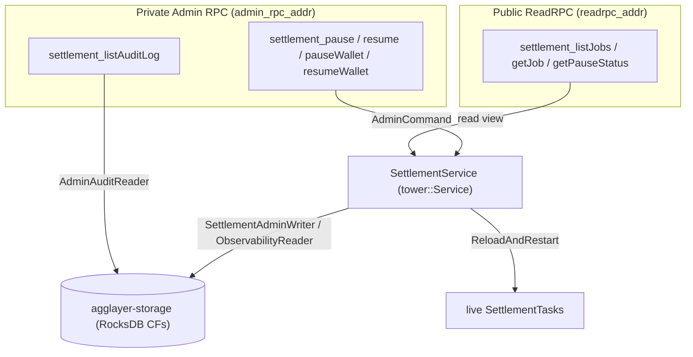
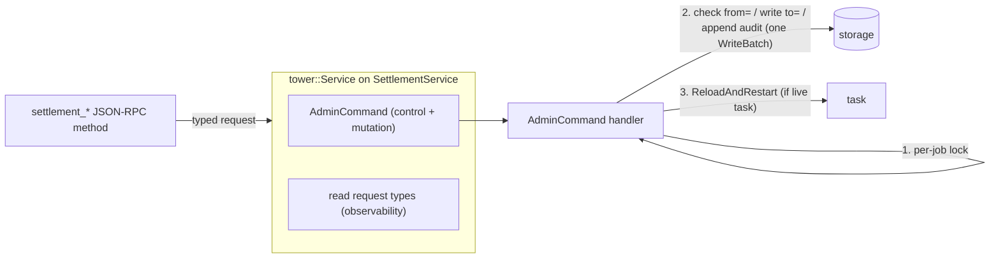
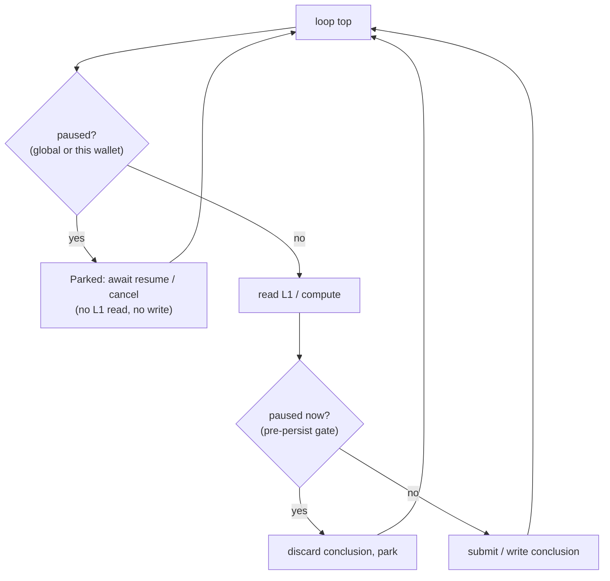

# Settlement Service Admin API — Design

| | |
|---|---|
| **Status** | Draft for review |
| **Date** | 2026-06-08 |
| **Ticket** | [agglayer/agglayer#1254](https://github.com/agglayer/agglayer/issues/1254) |
| **Target** | The new `agglayer-settlement-service` crate |
| **Decision owners** | @Ekleog-Polygon (settlement design intent), @Freyskeyd (assignee) |

> **Scope note (2026-07-07).**
> This design has been split in two.
> The mutation surface — registering and correcting attempts and job results,
> plus the JSON-RPC exposure of the abort/reload task controls — is
> implemented and recorded in
> [Settlement admin mutations](2026-07-07-settlement-admin-mutations-design.md),
> together with its deliberate deviations from the sketches below.
> This document keeps the parts that are not implemented yet:
> pause/resume with full quiesce and drain reporting,
> the observability read surface, and the durable admin audit log.
> Background snapshots and code references predate the mutation
> implementation and may be stale where they overlap it.

## Summary

This document designs a production-grade admin and observability API
for the new settlement service (`crates/agglayer-settlement-service`).

The settlement service drives one L1 contract call per `SettlementJob`
until it lands, retrying across nonces and wallets.
It is intentionally **infallible**:
a job has no terminal-failure state,
so the orchestrator can safely iterate on subsequent certificates.

The API delivers three capability groups:

- **Observability** — list and inspect jobs, attempts, results,
  derived status, and pause/drain status.
- **Control** — globally or per-wallet pause/resume settlement,
  with a trustworthy "everything has stopped" signal; abort and reload tasks.
- **Mutation** — add/edit settlement attempts and mark an attempt
  "definitely failed" so the job re-drives on a fresh nonce
  (the wallet-rotation and degraded-RPC fallbacks from the ticket).
  Split out and implemented — see the
  [mutations document](2026-07-07-settlement-admin-mutations-design.md);
  of this group, only audit-log coverage remains in scope here.

The anchor scenario is an **emergency pause during an L1 incident**:
a full quiesce in which tasks stop both submitting transactions
and writing on-chain-derived conclusions until an operator resumes.

## Goals

- Make the remaining ticket capability, pause, safe to operate in production
  (add/edit attempts and mark-definitely-failed/retry-with-new-nonce
  are implemented; see the mutations document).
- Provide the minimum observability required to use those capabilities
  without flying blind (there is no "list jobs" or status view today).
- Preserve the infallible-`SettlementJob` invariant.
- Inherit the "do no harm" properties of the existing admin surface
  (atomic, preconditioned edits; storage as single source of truth).
- Leave a durable forensic audit trail of every state-changing admin action.

## Non-goals

- The attempt/job mutation surface and the task abort/reload controls:
  implemented, and covered by the
  [mutations document](2026-07-07-settlement-admin-mutations-design.md).
  This document only adds on top of it (audit rows for its operations,
  and pause as the clean fix for its accepted insert race).
- A job-level terminal-failure state.
  This contradicts the infallible-job invariant
  and is deferred to an explicit maintainer decision (see Open Questions).
- Authentication/authorization beyond the existing network-boundary trust model.
- Retrofitting the existing certificate/network admin paths onto the new
  audit log (the audit envelope is designed to be reusable, but only
  settlement is wired up here).
- Implementing the settlement service's execution primitives
  (nonce assignment, submit-to-L1, task recovery);
  these are tracked separately and are treated here as dependencies.

## Locked decisions

| # | Decision | Choice |
|---|---|---|
| D1 | Scope | Control **and** observability plane |
| D2 | Primary scenario | Emergency pause during an L1 incident |
| D3 | What pause freezes | Submissions **and** conclusions (full quiesce) |
| D4 | Pause granularity | Global **and** per-wallet, persisted across restart |
| D5 | Mutation model | Declarative over stored state, `from=`/`to=` preconditions, apply via reload |
| D6 | Double-settle posture | Operator assertion + contract backstop; mandatory reason; mark-fail and re-drive are separate steps |
| D7 | Trust + audit | Network-boundary trust + durable, reusable audit log; tower `Layer` for tracing/metrics |
| D8 | Transport | Public reads on ReadRPC; mutations + audit read on the private Admin RPC; internal surface is the tower `AdminCommand` service |

D5 and D6 are implemented as part of the mutation split.
The implementation keeps their substance but not every sketched detail
(per-operation preconditions instead of literal `from=`/`to=` snapshots,
append-only insert instead of upsert, no audit rows yet);
the deviations are recorded in the mutations document (D1, D3, D6, D8).

## Background: the new settlement service

### Data model

Defined in `crates/agglayer-types/src/settlement.rs`.

- **`SettlementJob`** — one L1 contract call to land:
  `contract_address`, `calldata`, `eth_value`, `gas_limit`.
  Identified by a **`SettlementJobId`** (a `ulid::Ulid`, time-sortable).
- **`SettlementAttempt`** — one submitted L1 transaction for a job,
  keyed by `(sender_wallet, nonce)` then `attempt_number`:
  `sender_wallet`, `nonce`, `hash`, `submission_time`.
- **`SettlementAttemptResult`** — per-attempt outcome:
  `ClientError` (never reached a definitive on-chain state)
  or `ContractCall` (landed, `Success` or `Revert`).
- **`SettlementJobResult`** — the single terminal result of a job.
  It **requires** a `ContractCallResult`
  (`settlement.rs:85-90`, `:154-166`):
  a terminal outcome must have landed on-chain.

### Lifecycle

There is no explicit status enum.
Job state is *derived*: a job is pending while a `SettlementJob` row exists
with no `SettlementJobResult`, and completed once the result row is written
(`settlement_service.rs:187-204`).
The state machine lives entirely in `SettlementTask::run()`
(`settlement_task.rs:214`),
a single loop that polls control actions, queries L1 for each known nonce,
and writes a terminal result when an attempt settles.

### Current state (important constraints)

- The service is **not yet wired into the node**:
  `SettlementService` is constructed nowhere,
  and `lib.rs:9` still carries
  `#![allow(dead_code)] // TODO remove after settlement service is integrated`.
- The control surface is small:
  `admin_abort_task` (`settlement_service.rs:105`) and
  `admin_reload_and_restart_task` (`:111`),
  the latter's reload path still `todo!()` (`:161`, XREF #1230).
- Several execution primitives are stubs:
  task recovery (#1230), submit-to-L1 (#1321),
  nonce assignment (#1318/#1319), `is_wallet_privkey_known`
  (`settlement_task.rs:536`).
- Storage writers are deliberately constrained:
  `insert_settlement_attempt` is insert-only and
  `record_settlement_attempt_result` is upgrade-only
  via `can_be_replaced_by` (`settlement.rs:137`).
- The closest existing template is the JSON-RPC `admin` namespace
  (`crates/agglayer-jsonrpc-api/src/admin.rs`),
  especially `forceEditCertificate` (`admin.rs:165`):
  atomic `from=`/`to=` precondition edits with optional reprocessing.

## Architecture overview

### Two surfaces, two trust tiers



- **Public ReadRPC** carries only chain-mirroring observability,
  which is public-equivalent because settlement transactions are on public L1.
- **Private Admin RPC** carries every state-changing operation
  plus the audit-log read
  (the only place `actor`/`reason` operator metadata is exposed).
- No new listener is introduced;
  both surfaces reuse the transports the node already binds
  (`node.rs:334-336`).

Most public reads are store-backed,
but `getPauseStatus` and the `live_phase` field of `getJob`
need the in-memory task registry,
so the public router receives a **read-only view of `SettlementService`**
(its observability methods), not just the store.

### Internal surface: the tower `AdminCommand` service

The JSON-RPC methods are **thin adapters**.
They deserialize a request, build a typed tower request, call the service,
and serialize the response.
They never touch storage directly.



The `AdminCommand` handler is the single choke point
where audit-row writes and the mutation transaction live.
This extends the existing `AdminCommand` enum and its `tower::Service` impl
(`settlement_service.rs:260`),
widening its response from `()` to a typed `AdminResponse`.

The implemented mutation surface deliberately skips this indirection —
its JSON-RPC adapters call inherent `admin_*` service methods directly
(mutations document, D8).
The tower choke point returns with the audit-log work,
and the mutation commands would join it then.

### Mutation model (D5)

*Implemented with the mutation surface (mutations document, D6),
with per-operation preconditions instead of the literal `from=`/`to=`
check of step 2;
the audit append of step 3 arrives with the audit-log work below.*

All mutations are **declarative over stored state**, never in-memory patches:

1. The handler takes the per-job write lock
   (`StateStore.settlement_write_locks`, `stores/state/mod.rs:54`).
2. It reads the current stored value and checks it equals the caller's `from=`.
3. It writes `to=` and appends the audit row in the **same `WriteBatch`**.
4. If a live task exists for the job, it sends `ReloadAndRestart`,
   so the task tears down its in-memory `attempts` map
   and reloads fresh from storage.
   If no live task exists, the edit simply persists
   and is picked up on the next recovery.

Storage remains the single source of truth;
the live task only ever *reads* storage (start/reload),
so there is no live/stored divergence and no bespoke in-memory edit logic.
The reload path (#1230) was therefore the **linchpin dependency**
for all mutations and for resume;
it has since landed, and the implemented mutations rely on it.

## Data model and storage

### Attempt-level "definitely failed" (implemented)

The one `agglayer-types` change this design needed —
the `ClientErrorType::AbandonedByAdmin` attempt-result override,
with its emergent re-drive on a fresh nonce/wallet —
is implemented; see the mutations document (D3, D7).

### Persisted pause state (D4)

A presence-based CF mirroring the established durable-toggle pattern
of `disabled_networks_cf` (`columns/mod.rs:11`):

- `settlement_pause_cf`:
  key `Global` or `Wallet(Address)`;
  value `SettlementPauseRecord { actor, reason, since }`.
- "Globally paused?" = key `Global` present.
  Per-wallet pauses = scan.
- Loaded once at `SettlementService::start`
  (today a no-op stub, `settlement_service.rs:58-74`),
  so pause survives restart.

The runtime side (in-memory `watch`, the quiescence barrier, drain reporting)
is described under [Pause mechanism](#pause-quiesce-and-drain-mechanism).

### Audit log: reusable envelope, settlement as first consumer (D7)

The audit log is a storage-layer artifact, defined in `agglayer-storage`,
deliberately **not** in `agglayer-types`
(it is a forensic side-record the settlement logic never reasons about,
and keeping it out of tier-1 types avoids blast radius).

The envelope is **domain-agnostic and reusable**;
only settlement is wired up now.
The existing certificate/network admin paths
also lack durable audit today and could adopt it later (out of scope).

- CF `admin_audit_cf`, **always registered** (neutral).
- Key = `Ulid` (a global, chronological incident timeline,
  which also covers service-scoped actions like global pause
  that have no job id).
- Value `AdminAuditRecord { id, timestamp, actor, reason, domain,
  operation, target_ref, schema, payload }`.
- `payload` is a **proto-encoded domain message carried as `bytes`**,
  tagged by `schema` (e.g. `"settlement.v0"`).
  The bytes are a real proto message, never an arbitrary blob;
  carrying them as `bytes` keeps the envelope decoupled from each domain's proto.

### Dedicated traits and the `settlement-admin` feature

The capability split is enforced at the type level.

```rust
// Always compiled; powers the PUBLIC observability surface.
pub trait SettlementObservabilityReader {
    fn list_settlement_jobs(&self, filter, page) -> Result<…>;   // scan settlement_jobs_cf (ULID = chronological)
    fn list_jobs_by_wallet(&self, wallet, page) -> Result<…>;    // via settlement_attempt_per_wallet_cf index
    fn get_settlement_job_detail(&self, job_id) -> Result<…>;    // composes existing per-job readers
    fn get_pause_state(&self) -> Result<…>;                      // settlement_pause_cf
}

// Behind `settlement-admin`; NOT in the stores prelude; ADMIN surface only.
// (The attempt/result bypass writers sketched here originally are
// implemented on `SettlementWriter` instead — mutations document, D8.)
#[cfg(feature = "settlement-admin")]
pub trait SettlementAdminWriter {
    fn admin_set_pause(&self, scope, on, record) -> Result<…>;  // settlement_pause_cf
}

// Behind `settlement-admin`; ADMIN surface only. Neutral (reusable).
#[cfg(feature = "settlement-admin")]
pub trait AdminAuditReader {
    fn list_admin_audit(&self, time_range, filter, page) -> Result<…>;
}
```

The settlement **task** stays bounded by `SettlementReader + SettlementWriter`
only, so it cannot even name the bypass methods —
a compile-time guarantee that the invariant-bypassing path
is unreachable from normal code.
`SettlementService`'s admin path gains the `…Admin…` bounds.
The implemented mutation surface chose otherwise:
its bypass writers live on `SettlementWriter` with an `admin_` prefix and a
documented never-call-from-the-task contract, without a feature gate
(mutations document, D8).
Whether the remaining admin writer (pause) and the audit reader keep the
feature-gated shape sketched here is revisited at implementation time (OQ3).

The `settlement-admin` Cargo feature is primarily for **API-surface hygiene**:
a crate depending on `agglayer-storage` without the feature
cannot `use` the bypass trait,
so it never appears in autocomplete for unrelated code.
Caveat: Cargo features are additive and unified across a workspace build,
so in the final node binary the code is compiled in regardless —
the feature is authoring hygiene and build-slimming, not a runtime gate.
The trait boundary is the real guard.
The audit CF is always registered;
only the trait methods are feature-gated,
so toggling the feature never triggers a schema migration.

### Derived status view

Reads compose existing per-job readers plus the in-memory registries
into a computed `SettlementJobStatus`:
`Pending`, `Running` (a live task exists), `Paused` (running but quiesced),
`Settled { Success | Revert }` (has a terminal result).
No new persisted status column is introduced;
this stays consistent with the codebase's existing
"state is derived from row presence" approach.
A `stuck` flag (repeatedly reverting, or age beyond a threshold)
is surfaced as a derived field and feeds metrics —
the monitoring counterpart to an infallible job
(see Open Questions).

### Protobuf file organization

Codegen is buf + `protoc-gen-prost` (`buf.storage.gen.yaml`):
every `.proto` under `proto/agglayer/storage/v0/`
with `package agglayer.storage.v0;`
merges into the single generated
`crates/agglayer-storage/src/types/generated/agglayer.storage.v0.rs`.
Shared scalars (`Address`, `Nonce`, `TxHash`, `Uint128`, …)
live in `ethereum_types.proto`.

This adds **two new files**
(the enum edit sketched earlier — `CLIENT_ERROR_TYPE_ABANDONED_BY_ADMIN` —
already landed with the mutation implementation):

```
proto/agglayer/storage/v0/
  ethereum_types.proto        (existing — shared scalars)
  settlement.proto            (existing — ABANDONED_BY_ADMIN variant already added)
  admin_audit.proto           (NEW — neutral envelope)
  settlement_admin.proto      (NEW — settlement payload + pause record)
```

- `admin_audit.proto` (`message AdminAuditRecord`)
  imports only `google/protobuf/timestamp.proto`
  (and `ethereum_types.proto` if `target_ref` carries an `Address`).
  It does **not** import `settlement_admin.proto`;
  that missing import is the decoupling —
  the envelope depends on no domain.
- `settlement_admin.proto`
  (`message SettlementAdminPayload`, `message SettlementPauseRecord`)
  imports `settlement.proto` to reuse `SettlementAttempt`/`SettlementAttemptResult`.

Protos are always generated;
the `settlement-admin` feature gates only the Rust trait/impl
that uses `SettlementAdminPayload`.
Rust-side codecs use `impl_codec_using_protobuf_for!`
in `types/admin_audit.rs` and `types/settlement/…`.

### New column families

| New CF | Always vs feature | Pattern modeled on |
|---|---|---|
| `admin_audit_cf` | always | `disabled_networks_cf` + settlement proto CFs |
| `settlement_pause_cf` | always | `disabled_networks_cf` (presence toggle) |

Both are additive via the `ensure_cfs` migration step
(no data migration), the same way the settlement CFs were added
outside the `STATE_DB_V0` set.

## Pause, quiesce, and drain mechanism

### Durable state plus hot path

- **Durable**: `settlement_pause_cf`, loaded once in `SettlementService::start`.
- **Hot path**: the service holds a `watch::Sender<PauseState>`
  (`{ global: Option<PauseRecord>, wallets: HashMap<Address, PauseRecord> }`);
  every `SettlementTask` holds a `watch::Receiver<PauseState>`.
  Admin pause/resume writes storage **and** updates the watch.
  The watch lets a parked task sleep cheaply and wake instantly on resume.

### Two enforcement gates (full quiesce, D3)

"Zero on-chain-derived decisions while paused" requires two gates:

1. **Loop-top barrier**, next to `try_handle_control_action`
   (`settlement_task.rs:419`):
   if `global` is set, or the wallet this task would act on is paused,
   the task transitions to **Parked** and awaits the watch (resume)
   or cancellation.
   It does not even read L1.
2. **Pre-persist gate**, immediately before every conclusion writer
   (`write_job_result_to_db` `:867`, the nonce-revert/external writers)
   and before `submit_attempt_to_l1` (`:459`):
   re-check pause.
   If pause landed mid-iteration after a read but before the write,
   discard the just-computed conclusion (safely re-derived on resume) and park.

Gate 1 handles the common case;
gate 2 closes the race so a conclusion derived from a pre-pause read
can never be persisted during a pause.



### Trustworthy drain reporting

Drain status uses state, not delta-counters.
Each `TaskControlHandle` carries a `watch::Sender<TaskRuntimeState>`
(`Running | Parked | …`).
`getPauseStatus` aggregates over the `task_controls` registry:

```text
{ global_paused, paused_wallets,
  total_tasks, parked_tasks,
  not_yet_parked: [ { job_id, phase } … ] }   // pinpoints stragglers
```

"Fully drained" = `global_paused && parked_tasks == total_tasks`.
Trustworthiness depends on ordering:
the pause watch is set **before** counting,
so any task spawned afterward already observes the pause and parks.
New tasks spawned while paused start directly in `Parked`.

### Call semantics: return-now and poll

`pause` returns immediately with the initial snapshot;
the operator polls `getPauseStatus` (or subscribes)
until `parked == total`.
This is robust to many tasks and avoids long-held RPC connections.
An optional `wait=true` with a timeout can be added later.

### Resume, restart, and intake

- **Resume**: clear the storage record and update the watch.
  Each parked task wakes, reloads from storage,
  then re-evaluates with fresh L1 reads
  (the run loop already re-queries on each iteration).
  This picks up any admin edits made during the pause
  and guarantees no action on stale pre-incident reads.
- **Restart**: `start` loads `settlement_pause_cf`;
  if globally paused, the watch is seeded paused,
  so any task recovered later (#1230) parks immediately.
  A mid-incident restart comes back paused.
- **Intake while paused** (infallibility-critical):
  `request_new_settlement` still records the `SettlementJob` row,
  but the spawned task starts **Parked**.
  Intake is never rejected —
  rejecting would bubble "cannot settle" up to the orchestrator
  and violate the infallible-job invariant.

### Per-wallet pause

A per-wallet pause gates "build/submit a new attempt on wallet W."
For wallet rotation you pause the old wallet so nothing new lands there.
Whether a task **fails over** to another wallet or **parks**
depends on the wallet-selection policy
in `build_next_attempt_with_new_nonce` (#1318, currently `todo!()`),
so this design defines the gate and defers failover to #1318.

## API surface

Namespace `settlement`.
Reads are dedicated tower request types (`SettlementObservabilityReader`);
control extends the `AdminCommand` enum (`SettlementAdminWriter`).
The implemented mutations joined the `admin` namespace instead
(mutations document, D8);
settle on one namespace story for the remaining methods at implementation
time.

### Group A — Observability (public ReadRPC; no audit row)

| Method | Params | Response | Errors |
|---|---|---|---|
| `settlement_listJobs` | `filter{status?, wallet?, stuck?, since?, until?}`, `page{limit,cursor}` | `{jobs:[{job_id, status, contract_address, created_at, attempt_count, revert_count, age, stuck}], next_cursor}` | InvalidArgument |
| `settlement_getJob` | `job_id` | `SettlementJobDetail{job, status, attempts:[{seq,attempt,result?}], terminal_result?, stuck, revert_count, live_phase?}` | ResourceNotFound |
| `settlement_getPauseStatus` | — | drain snapshot (above) | — |

### Group B — Control (private Admin RPC; audit row; `reason`+`actor` required)

| Method | → `AdminCommand` | Response | Notes |
|---|---|---|---|
| `settlement_pause` | `PauseGlobal{reason,actor}` | drain snapshot | idempotent |
| `settlement_resume` | `ResumeGlobal{…}` | `()` | reload + re-evaluate on wake |
| `settlement_pauseWallet` | `PauseWallet{wallet,…}` | `()` | submission gate |
| `settlement_resumeWallet` | `ResumeWallet{wallet,…}` | `()` | |

`abortTask` and `reloadTask` are already exposed as
`admin_abortSettlementTask` / `admin_reloadSettlementTask`
(mutations document); the only work left for them here is audit coverage.

### Group C — Mutation (implemented; see the mutations document)

The mutation surface is implemented and recorded in the
[mutations document](2026-07-07-settlement-admin-mutations-design.md):
append-only insert, mark-attempt-definitely-failed,
remove-attempt-result, and force-remove-job-result,
in the `admin` namespace.
What remains in scope here is audit coverage:
when the audit log lands, these operations gain audit rows and the
mandatory `reason` + `actor` metadata of cross-cutting rule 1
(mark-definitely-failed already carries a mandatory `reason`,
persisted only in the attempt result's message until then).

### Group D — Audit read (private Admin RPC; `AdminAuditReader`)

| Method | Params | Response | Errors |
|---|---|---|---|
| `settlement_listAuditLog` | `time_range`, `filter{operation?,job_id?,actor?}`, `page` | `{records:[AdminAuditRecord], next_cursor}` | InvalidArgument |

`settlement_editJobPayload` (calldata/proof) is **deferred**;
it exists only if maintainers pick fork (A) in Open Question 1.

### Internal types

```rust
pub enum AdminCommand {
    PauseGlobal { reason: String, actor: String }, ResumeGlobal { … },
    PauseWallet { wallet: Address, … },           ResumeWallet { … },
    AbortTask { job_id: SettlementJobId, … },      ReloadAndRestartTask { … },
    // … plus the implemented mutation operations (mutations document),
    // folded in when the audit choke point lands.
}
pub enum AdminResponse { Ack, PauseStatus(DrainSnapshot) }   // widened from today's ()
```

### Cross-cutting rules

1. **Mandatory `reason` + `actor`** on every B/C operation,
   producing one atomic audit row written in the same `WriteBatch`
   as the mutation.
2. **Mutation transaction**: per-job lock → read current → assert `== from`
   → write `to` → append audit → release → reload live task (if any).
3. **`from=`/`to=` mismatch → `InvalidArgument`**
   (consistent with `forceEditCertificate`), leaving state untouched.
4. **Errors** reuse the existing `Error` type
   (`ResourceNotFound` = `-10008`, `InvalidArgument`, `internal`);
   no new codes.
5. **Pause does not gate admin mutations.**
   Pause freezes task autonomy, never the operator's deliberate edits
   (pause → edit → resume is a core workflow).
   The tower `Layer` performs tracing/metrics/audit-intent only.
6. **`abortTask` is not abandonment.**
   It stops the current in-memory task;
   the `SettlementJob` row persists and can be re-spawned.
   There is no admin path to a terminal job failure in v1.

Rules 2 and 3 describe the draft's snapshot-precondition shape;
the implemented mutations keep their substance (precondition-checked,
atomic under the per-job lock, state untouched on mismatch) with
per-operation preconditions instead of literal `from=`/`to=` snapshots
(mutations document, D1, D6).
The audit work should follow the implemented shape.

## Safety invariants (implementation contract)

1. **Infallible-job preserved.**
   No v1 admin op produces a terminal job failure;
   `abortTask` and `markAttemptDefinitelyFailed` are runtime/attempt-level only.
2. **Full quiesce.**
   A paused task never submits and never persists a conclusion (two gates).
3. **Atomicity.**
   Each mutation and its audit row commit in one `WriteBatch`
   under the per-job lock; all `from=` checks precede any write.
4. **Single source of truth.**
   Live tasks only read storage; admin never patches in-memory state.
5. **Pause survives restart.**
6. **Intake never rejected** (recorded + parked while paused).
7. **Capability containment.**
   Bypass writers are unreachable from the settlement task (compile-time).
   (The implemented mutation surface relaxed this to a documented
   convention — mutations document, D8; whether the remaining surface
   restores the compile-time shape is part of OQ3.)
8. **Auditability.**
   Every state-changing admin action leaves a durable, time-ordered record
   with `actor` + `reason`.
9. **Double-settle backstop (assumption).**
   `markAttemptDefinitelyFailed` is a trusted operator assertion;
   its safety rests on the L1 settlement contract being replay-safe
   (Open Question 6).

## Personas and runbooks

These double as acceptance scenarios.

- **SRE — L1 incident (primary).**
  `pause` → poll `getPauseStatus` until `parked == total` (trustworthy halt)
  → investigate out-of-band → `resume`
  (tasks reload and re-evaluate on fresh reads)
  → `listAuditLog` for the timeline.
- **Protocol engineer — wallet rotation (ticket core).**
  `pauseWallet{OLD}` → bring up the new signer →
  for each stuck job: `getJob` →
  `markAttemptDefinitelyFailed{reason}` → auto-reload →
  the task re-drives on the new wallet (#1318) → settles.
  Relies on contract replay-safety.
- **SRE — stuck/underpriced nonce.**
  `getJob` → if the tx was cancelled/replaced out-of-band,
  `addAttempt` to register the replacement;
  if the nonce is dead, `markAttemptDefinitelyFailed` → re-drive.
- **Operator — degraded RPC.**
  Confirm settlement via a block explorer →
  `editAttempt` / `markAttemptDefinitelyFailed`
  to inject the conclusion the service cannot auto-derive.
- **Reviewer (read-only).**
  `listJobs` + `getJob` on the public surface;
  `listAuditLog` on the admin surface for post-incident analysis.

## Dependency and phasing map

| Phase | Deliverable | Depends on | Blocked by stubs? |
|---|---|---|---|
| **0 Foundations** | CFs + types/proto, traits (`ObservabilityReader` always-on; `AdminWriter`/`AdminAuditReader` feature-gated) + `MockStateStore`, audit envelope + tower `Layer`, derived status + list/scan readers | — | No (storage/types; mock-testable) |
| **1 Observability API** | `listJobs`/`getJob`/`getPauseStatus` on ReadRPC; `listAuditLog` on Admin RPC | node integration (construct + `Arc`-share `SettlementService`; mount namespaces) | No |
| **2 Pause/resume** | `PauseState` watch + two gates + per-task `TaskRuntimeState` + `getPauseStatus` + pause/resume(+wallet) + restart-loads-pause | Phase 0; the task loop (exists) | No for global; per-wallet failover needs #1318 |
| **3 Mutations** | Implemented — see the mutations document; only audit coverage remains | reload path #1230 (landed) | No |
| **4 (conditional)** | `editJobPayload` | maintainer fork (A) | — |

`abortTask`/`reloadTask` are exposed on JSON-RPC by the mutation
implementation; they only need audit (fold into Phase 1/2).
The old critical path — node integration (#1393) and the #1230 reload —
has since landed.
Pause and observability — the anchor value —
are reachable without the deep execution stubs.

## Open questions

### OQ1 — Infallible `SettlementJob` vs externally-impossible settlement

The design treats `SettlementJob` as infallible
(retries until it lands; no terminal-failure state)
so the orchestrator can safely iterate on subsequent certificates.
The settlement admin API must respect this.

**Covered by the infallible model:**
transient L1 issues (retry + pause);
lost-key/nonce-gap after wallet rotation
(mark the dead *attempt* abandoned → re-drive on a new wallet);
missing finalization RPC (manual attempt-result override).

**Not covered — needs a decision:**
prover/verifier incompatibility
(for example, a proof rejected after a verifier/SP1 upgrade; cf. #1525).
Every attempt reverts forever; re-nonce-ing cannot help.

**Fork:**

- **(A) Stay infallible, recover by correcting inputs** —
  allow swapping the job's calldata/proof;
  pause holds the job during the incident.
  Needs a (dangerous) job-payload-edit admin op and a proof-regeneration flow.
- **(B) Allow a job-level terminal-failure state** —
  needs a defined cascade onto already-accepted subsequent certificates
  (rollback / network halt / re-issue), a consensus-level design.

**Admin-API proposal pending this decision:**
ship only infallible-consistent tools —
pause/resume, attempt-level abandon + re-drive,
and a "stuck/reverting job" alarm.
Add job-payload edit only under (A).
Do **not** add job-level terminal failure unless (B) is chosen
and its cascade designed.

If (B) is ever chosen, the smaller-blast-radius option is a separate
`settlement_job_abandoned_cf` marker
(terminal = "has result or has abandon marker"),
which leaves the hot `SettlementJobResult` type and the result watcher untouched.

### OQ2 — Audit payload encoding (resolved)

Proto. The neutral envelope carries the payload as `bytes`
(a proto-encoded domain message) plus a `schema` discriminator,
keeping the envelope decoupled from each domain's proto.

### OQ3 — `settlement-admin` feature flag

Included for API-surface hygiene, with the additive-features caveat documented.
Reviewers may veto in favour of the trait boundary alone.
The implemented mutation surface shipped without the feature and without a
separate trait (mutations document, D8);
the question stays open for the pause writer and the audit reader.

### OQ4 — Per-wallet pause: failover vs park

Whether a task fails over to another wallet or parks
ties to the wallet-selection policy in #1318.
This design defines the gate and defers the behavior.

### OQ5 — Public/private read split (resolved)

Everything except the audit log is public (chain-mirroring data on ReadRPC);
the audit log read stays on the private Admin RPC,
since `actor`/`reason` operator metadata is the only non-public content.
No new listener; no redaction needed.

### OQ6 — Contract replay-safety (must confirm)

Invariant 9 and the entire double-settle posture (D6)
depend on the L1 settlement contract being replay-safe
(a duplicate settlement reverts or no-ops).
This must be confirmed with the settlement-contract owners
before relying on `markAttemptDefinitelyFailed` in production —
all the more pressing now that the operation is implemented
(as `admin_markSettlementAttemptDefinitelyFailed`, alongside
`admin_forceRemoveSettlementJobResult`, which leans on the same backstop).

## Appendix: key code references

- Domain types: `crates/agglayer-types/src/settlement.rs`
  (`SettlementJobResult` `:85`, `can_be_replaced_by` `:137`,
  `ContractCallResult` `:154`).
- Service + admin surface: `crates/agglayer-settlement-service/src/settlement_service.rs`
  (`start` `:58`, `admin_abort_task` `:105`, `admin_reload_and_restart_task` `:111`,
  reload `todo!()` `:161`, derived pending/done `:187-204`, `AdminCommand` `:260`).
- State machine: `crates/agglayer-settlement-service/src/settlement_task.rs`
  (`run` `:214`, `try_handle_control_action` `:419`,
  `is_wallet_privkey_known` `:536`, `build_next_attempt_with_new_nonce` `:398`,
  `write_job_result_to_db` `:867`).
- Existing admin template: `crates/agglayer-jsonrpc-api/src/admin.rs`
  (`forceEditCertificate` `:165`, `start` `:237`).
- Storage: `crates/agglayer-storage/src/columns/mod.rs`
  (`DISABLED_NETWORKS_CF` `:11`, settlement CFs `:32-36`),
  per-job lock `crates/agglayer-storage/src/stores/state/mod.rs:54`.
- Node wiring: `crates/agglayer-node/src/node.rs`
  (admin router `:306-315`, listeners `:334-336`).
- Codegen: `buf.storage.gen.yaml`, protos under `proto/agglayer/storage/v0/`.
- Related issues: #1230 (reload/recovery), #1318/#1319 (nonce assignment),
  #1321 (submit-to-L1), #1314, #1382, #1525 (SP1 v6 migration).
